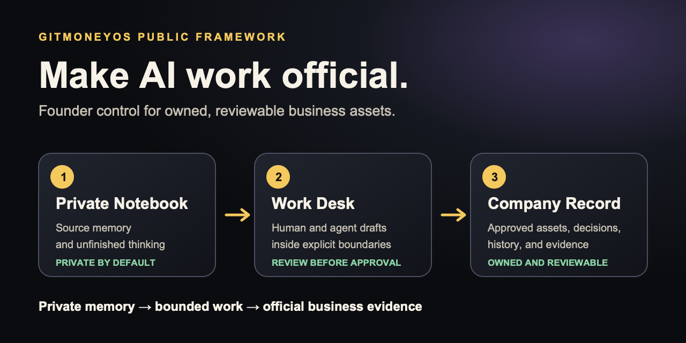
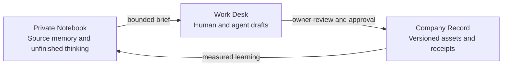

# GitMoneyOS Public Framework

> **Turn AI-assisted work into owned, reviewable business assets.**

AI can produce work faster than a founder can review, approve, remember, or hand it off. GitMoneyOS gives that work a plain-English control system so the business can prove:

- what became official
- who owns it
- who approved it
- what evidence supports it
- when it should be reviewed again

GitMoneyOS is built for nontechnical founders, operators, agencies, knowledge businesses, and small SaaS teams. GitHub is the trust layer, not the subject you have to master.

## Start In Ten Minutes

1. Complete the [Exit-Ready Score](docs/exit-ready-score-self-assessment.md) privately.
2. Follow the one next step assigned to your score band.
3. Turn one scattered piece of work into a governed **First Official Asset**.

**Choose your route:** [START_HERE.md](START_HERE.md)

**Verify the system:** [Five-minute proof route](docs/proof-package/README.md)

**Work with GitMoneyOS:** [Audit, Setup Sprint, or Fractional Operator](CONSULTING.md)

## The Condition GitMoneyOS Fixes

| Before | After |
| --- | --- |
| Important work is scattered across chats, drives, notes, contractors, and AI tools | Each approved asset has one governed home |
| AI output looks finished but has no clear authority | Humans own approval; agents produce reviewable work |
| Decisions disappear into meetings and message history | Issues, pull requests, and commits preserve the receipt |
| The founder is the only person who knows how the business works | A trusted operator can inspect ownership, evidence, and next actions |
| Private thinking and public proof are mixed together | Private memory stays private; only approved records are promoted |

## The Three-Room AI Office

### 1. Private Notebook

Obsidian or another local memory system holds raw doctrine, research, notes, prompts, and unfinished thinking. It is allowed to be messy. It is not automatically the company record.

### 2. Work Desk

Codex, Claude Code, Antigravity, and human operators turn approved source context into bounded drafts, tasks, audits, decisions, and proposals. Agents may prepare work. They do not silently approve it.

### 3. Company Record

GitHub stores the approved version, owner, change history, review, and evidence. A repository is a business vault. An issue is a trackable task or risk. A pull request is the approval packet. A commit is the receipt.

Plain-English rule:

> The private notebook can think messy thoughts. The work desk can shape them. The company record receives only approved business evidence.

## Create A First Official Asset

Choose one useful item that currently lives in a chat, note, folder, or person's memory:

- operating procedure
- decision record
- approved prompt or agent rule
- scorecard
- product or delivery specification
- public contribution

It becomes an asset when it has all five:

1. **Owner:** one accountable human or role.
2. **Approval:** a known review path.
3. **Evidence:** a file, commit, pull request, issue, or accepted confirmation.
4. **Reuse path:** a real job it performs again.
5. **Lifecycle:** a next review, update, archive, or retirement point.

If the asset is private, keep its receipt private. If the asset and evidence are safe to share, use the optional [First Official Asset receipt](https://github.com/GitMoneyOS/gitmoney-public-framework/issues/new?template=first-official-asset.yml).

## Who This Serves

| Owner | Control failure | Recommended first route |
| --- | --- | --- |
| AI-enabled agency owner | Delivery knowledge, contractor work, and client-neutral assets have unclear ownership | Exit-Ready Score → AI Office Audit |
| Founder-led SaaS team using coding agents | AI output grows faster than product and architecture review | Agentic Repo Governance Check |
| Knowledge-business founder | Private doctrine does not reliably become approved offers, systems, or records | Private Vault To Official Record Audit |
| Nontraditional AI-era builder | Real contribution exists, but judgment and growth are hard to verify | GitBuilt Proof Sprint, after pilot gates pass |

ICP details and exact next actions live in [START_HERE.md](START_HERE.md).

## What GitMoneyOS Is

- A founder-readable control system for AI-assisted work.
- A method for turning scattered effort into governed assets.
- A boundary between private memory, agent work, and official record.
- An Audit → Setup Sprint → Fractional Operator delivery engine.
- A public proof system that states what is observed, inferred, and still unproven.

## What GitMoneyOS Is Not

- A generic prompt library.
- A coding bootcamp.
- A requirement to publish private notes, scores, or client evidence.
- A replacement for legal, financial, security, investment, or transaction advice.
- Proof of outcomes that have not been measured.

## Verify The Framework

The [Public Proof Package](docs/proof-package/README.md) provides a five-minute verification path and a deeper evidence library. The [Healing Dashboard](HEALING-DASHBOARD.md) records public-safe self-corrections. The [Scrumban self-annealing board](docs/governance/self-annealing-board-2026-07-13.md) shows the current work, WIP limits, evidence, and owner gates.

## Repository Map

- [`START_HERE.md`](START_HERE.md): buyer and participant routes.
- [`CONSULTING.md`](CONSULTING.md): diagnostic and delivery offers.
- [`docs/exit-ready-score-self-assessment.md`](docs/exit-ready-score-self-assessment.md): private-first ten-minute assessment.
- [`docs/proof-package/`](docs/proof-package/README.md): proof of concept, work, and quality.
- [`docs/answers/`](docs/answers/README.md): answer-first founder guidance and evidence boundaries.
- [`docs/challenges/first-official-asset.md`](docs/challenges/first-official-asset.md): seven-day activation ritual.
- [`docs/students/`](docs/students/): founder and builder learning paths.
- [`AGENTS.md`](AGENTS.md): AI contribution boundaries.
- [`CONTRIBUTING.md`](CONTRIBUTING.md): human contribution and review path.
- [`.github/`](.github): ownership, templates, automation, and evidence controls.

## Long-Horizon Operating Standard

The source doctrine uses 9-Figure Ease as an ambition and operating standard, not an outcome claim. The useful discipline is simple: a business cannot carry serious scale if its knowledge, decisions, access, and AI-assisted work depend on one overextended founder. GitMoneyOS helps make that complexity more visible and governable. It does not guarantee scale, valuation, diligence, security, investment, or acquisition outcomes.

## Ownership And Approval

GitMoneyOS is a KnowTheLedge project built by Red Pillar and Hitsuyo Aku.

Public positioning changes require both owners to approve the pull request before merge. Merging into `main` means the public framework has accepted the change as its current official record.

## Safe Contribution Boundary

Never post credentials, access details, client identities, private screenshots, confidential strategy, raw vault material, or unsupported claims. Read [SECURITY.md](SECURITY.md) and [CONTRIBUTING.md](CONTRIBUTING.md) before submitting work.
