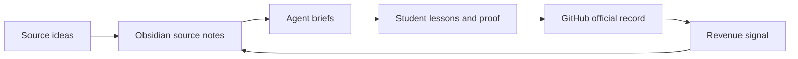

# GitMoney AI Office Source Pack

Version: v1.1
Owner: Red Pillar and Hitsuyo Aku, under KnowTheLedge
Audience: GitMoneyOS students, founders, creators, and operators
Layer classification: GitHub record

## What This Is

This source pack turns AI Office research into a preparation lesson, a four-week student path, and a synthesis capstone. It is not a reading pile. It is a way to practice the GitMoney loop:

Plain-English stack:

- **Obsidian is private memory.** Raw thinking and source notes live here first.
- **Agent platforms are workbenches.** Briefed jobs turn source material into drafts.
- **GitHub is the official record.** Approved work becomes evidence.
- **Governor Review keeps it alive.** Work gets reviewed instead of forgotten.

## The Preparation Lesson, Four Core Lessons, And The Capstone

1. [Week 0: Agentic Systems First Principles](week-0-agentic-systems-first-principles.md)
2. [Week 1: GitHub Is The Official Record](week-1-github-official-record.md)
3. [Week 2: Obsidian Is Private Memory](week-2-obsidian-private-memory.md)
4. [Week 3: Agents Are Workbenches](week-3-agent-workbench.md)
5. [Week 4: Governor Review Keeps The Office Alive](week-4-governor-review.md)
6. [Capstone: The Cybernetic Revenue Loop](capstone-cybernetic-revenue-loop.md)

Week 0 establishes the safety, ownership, and evidence rules. The four core lessons teach the layers. The capstone reveals that the layers were always one system: a business that captures its own signal, diagnoses its own leaks, routes its own work, and learns from its own results.

## How To Use This Pack

Do one lesson at a time. Each lesson gives you:

- one lesson objective,
- one worked example,
- one proof artifact,
- one promotion boundary,
- one completion checklist.

The goal is not to memorize AI vocabulary. The goal is to turn your own work into governed proof.

## Related Kit

Use this with the [GitMoney Obsidian Office](../gitmoney-obsidian-office/README.md), the Week 2 private memory layer for the GitMoney AI Office.

## Boundary

This public pack summarizes concepts from internal source material. It does not include private PDFs, internal pricing, investor strategy, client data, or unsupported legal, financial, security, valuation, acquisition, or revenue claims.
