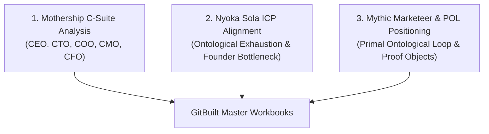

# GitBuilt Master Workbooks  -  Public Framework & Curriculum

Welcome to the official **GitBuilt Master Workbook Series** repository inside the `gitmoney-public-framework`. 

This series provides the complete, plain-English curriculum for turning AI models, coding agents, MCP tools, and LLM search optimization into cash-flowing software assets.

---

## Strategic Framing & Diagnostic Analysis

Every workbook in this series has been analyzed and framed through the **GitMoney OS Skill Triad**:

### 1. Mothership C-Suite Strategic Diagnosis
- **CEO (Hitsuyo Aku / System 5)**: Governed by `IFL-V1-SL-2026-07-24` Singular Law. Establishes the workbooks as Stage 2 Research and Stage 8 Proof objects that convert cold traffic into qualified GitBuilt sprint candidates.
- **CTO (System 2)**: Maps the 8 modules of Workbook 2 to live terminal agents (Claude Code, Cursor, Aider), Model Context Protocol (MCP) servers, and local AI runner stacks (Ollama, LM Studio).
- **COO (System 3)**: Enforces WIP limits (Cap: 3 active tasks in `Doing`) and strict operational execution for student cohorts.
- **CMO (System 4)**: Enforces 0-fluff copy rails (**0 emojis, 0 em-dashes** in public docs). Diagnoses buyer wounds in plain English: name the friction, free work destabilizes, paid implementation closes the case.
- **CFO (System 3)**: Maps unit economics ($0 to $10K cold traffic, $10K to $50K growth engine, $50K to $250K+ scaling) with a mandatory minimum 70% commercial margin.

### 2. Nyoka Sola ICP Alignment
- **Target Persona**: High-functioning builders, agency founders, and creators ($80k-$300k/yr) suffering from **Ontological Exhaustion** and the **Founder Bottleneck**.
- **The Core Problem**: Founders acting as human middleware between prompt text and live business outputs.
- **The Solution**: Converting prompt chaos into clean Markdown notes, Git repositories, automated skills, and plain-English GitHub workflows.

### 3. Mythic Marketeer & POL Positioning
- **The Fable vs. The Matrix**: Replaces the illusion of "AI prompt magic" with autopoietic, receipt-gated software systems.
- **Proof Objects**: Workbooks act as verifiable proof objects that establish authority before any commercial transaction.

---

## Workbook Directory & Download Links

| Workbook | Description | PDF Master | Markdown Edition | Answer Key |
| :--- | :--- | :--- | :--- | :--- |
| **Workbook 2: Skills, Workflows & Repos** | Coding agents, MCP servers, local AI, design/marketing/research skills, and 20-question final assessment. | [Download PDF](../master-pdf/GIT_BUILD_Workbook2_Skills_Workflows_Repos.pdf) | [Read Guide](workbook-02-skills-workflows-repos.md) | [Instructor Key](workbook-02-answer-key.md) |
| **Workbook 2: Answer Key & Solutions** | Complete instructor copy, quiz rationale, and exercise rubrics across all 8 modules. | [Download PDF](../master-pdf/GIT_BUILD_Workbook2_Answer_Sheet.pdf) | [Read Solutions](workbook-02-answer-key.md) |  -  |
| **Workbook 3: AI Recommendations & Business Scaling** | AI search hijack (GEO, Gemini 3.0 SEO), prompt systems, and Daniel Fazio's scaling framework to $250K/mo. | [Download PDF](../master-pdf/GIT_BUILD_Workbook3_AI_fable.pdf) | [Read Guide](workbook-03-ai-fable-recommendations-scaling.md) | Self-Assessment |

---

## Curriculum Structure

### Workbook 2: Skills, Workflows & GitHub Repositories
- **Module 1: Coding Agents & IDEs**  -  Claude Code, Cursor, Aider, Windsurf.
- **Module 2: Agent Frameworks**  -  LangChain, LlamaIndex, AutoGen, CrewAI.
- **Module 3: MCP Servers & Tooling**  -  Model Context Protocol, Supabase, GitHub, Rube.
- **Module 4: Local AI & Infrastructure**  -  Ollama, LM Studio, vLLM, Local RAG.
- **Module 5: Creative & Design Skills**  -  UI/UX, 3D CSS, GSAP, Brand Systems.
- **Module 6: Marketing & Content Skills**  -  Cold Email, Copywriting, CAC, Content Factory.
- **Module 7: Research & Intelligence**  -  Apify, Firecrawl, Exa, OSINT.
- **Module 8: Product & Building**  -  Next.js, Vite, Supabase, Stripe, MVP Shipping.

### Workbook 3: AI Recommendations & Business Scaling
- **Module 1: The AI Recommendation Economy**  -  Transition from Google SERP to AI Assistant Search.
- **Module 2: The Top 10 Prompt System**  -  Optimizing for ChatGPT, Claude, and Copilot selection.
- **Module 3: Gemini 3.0 SEO Domination**  -  Indexing, Entity Graphs, and Schema.org markup.
- **Module 4: The 90-Day AI Domination Plan**  -  Actionable timeline for AI search dominance.
- **Module 5: Cold Traffic Mastery ($0 to $10K/mo)**  -  Outreach, offer wedge, initial traction.
- **Module 6: The Growth Engine ($10K to $50K/mo)**  -  Content engines, pipeline scaling.
- **Module 7: Scale to $250K+ (Systems & Capital)**  -  Delegated agent swarms and operations.
- **Module 8: The GITBUILT Money Matrix**  -  Combined recommendation and scaling matrix.

---

## Verification & Integrity

All workbooks in this release are verified against the GitMoney OS zero-trust security gate, containing zero secret keys, zero AI fluff words, and 100% plain-English documentation.
