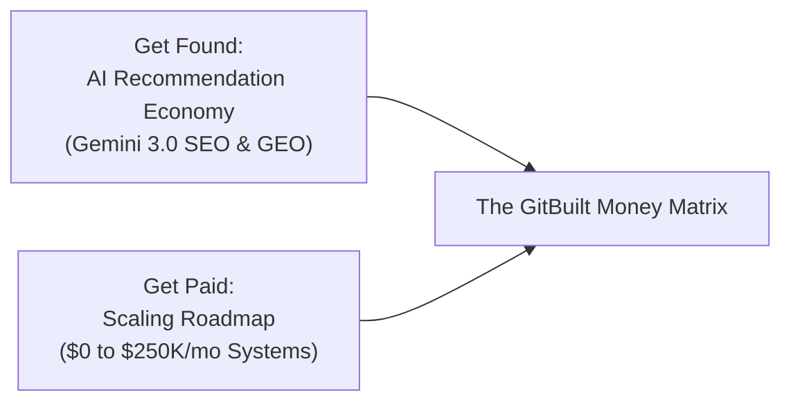

# GitBuilt Workbook 3  -  AI Recommendations & Business Scaling

**Two Frameworks Combined: Jimmy Reilly's AI Recommendation Blueprint & Daniel Fazio's Scaling Roadmap to $250K/Month**  
*Get Found. Get Paid.*

---

## Executive Summary & Combined Playbook

Workbook 3 combines two of the most effective frameworks in the modern AI business market:
1. **The AI Recommendation Economy (Jimmy Reilly's Blueprint)**: A system for structuring content and technical entities so AI assistants (ChatGPT, Claude, Copilot, Gemini 3.0) select and recommend your product as the top solution.
2. **Business Scaling Roadmap (Daniel Fazio's Framework)**: A battle-tested revenue roadmap taking operators from $0 to $10K (Cold Traffic Mastery), $10K to $50K (The Growth Engine), and $50K to $250K+ (Systems & Capital).

Most operators possess either recommendation visibility or scaling systems. GitBuilt operators possess both.

---

## Part 1: THE DNA  -  The AI Recommendation Economy

### Module 1: The AI Recommendation Economy
- **The Shift**: Search behavior is migrating from traditional search engine result pages (SERPs) to conversational AI assistants.
- **Generative Engine Optimization (GEO)**: Structuring brand assets, schemas, and citation sources so AI models ingest your business as canonical truth.
- **Entity Authority**: Building clean Schema.org markup (JSON-LD), entity graphs, and plain-English documentation across GitHub and public indices.

#### Action Steps:
1. Audit how ChatGPT, Claude, and Gemini answer query prompts regarding your industry.
2. Map your product's core features into standard Schema.org entity formats.

---

### Module 2: The Top 10 Prompt System
- **Prompt Hijacking Mechanics**: Understanding how LLMs summarize recommendations for buyer intent queries (e.g. "What is the best tool for X?").
- **Citation Anchors**: Establishing authoritative public reference documents (GitHub repos, technical whitepapers, documentation hubs) that LLMs reference during RAG passes.
- **Comparison Pages**: Creating objective, structured comparison matrices that position your offer clearly without hyperbole.

#### Action Steps:
1. Identify the top 10 buyer intent prompts for your target market.
2. Author Markdown reference notes addressing each prompt with verifiable evidence.

---

### Module 3: Gemini 3.0 SEO Domination
- **Google Knowledge Graph Integration**: Aligning brand entity properties with Google Knowledge Graph schemas.
- **Structured JSON-LD**: Implementing structured data markup for software applications, products, and organizations.
- **Fast Crawl Indexing**: Utilizing clean HTML, Sitemap XML, and semantic heading hierarchies for rapid indexing.

#### Action Steps:
1. Deploy `JSON-LD` schema markup across your public web properties.
2. Validate indexing via Google Search Console and public entity lookups.

---

### Module 4: The 90-Day AI Domination Plan
- **Month 1 (Foundation)**: Author core documentation, schema markup, and public GitHub repository assets.
- **Month 2 (Amplification)**: Publish case studies, technical whitepapers, and public proof packages.
- **Month 3 (Authority Lock)**: Monitor AI assistant recommendations and refine entity citations based on model responses.

---

## Part 2: GIT MONEY  -  Business Scaling Roadmap

### Module 5: Cold Traffic Mastery ($0 to $10K/Month)
- **The Offer Wedge**: Defining a narrow, high-value diagnostic or setup sprint that solves an immediate operational pain point.
- **Outbound System**: Cold email infrastructure, personalized video briefs, and direct messaging with 0-fluff copy rails.
- **Conversion Path**: Plain-English discovery -> Diagnostic Brief -> One clear next step.

#### Execution Metrics:
- Target 100–300 qualified prospect dispatches per week.
- Convert 3–5 initial setup sprint clients at $2,500–$3,500 per install.

---

### Module 6: The Growth Engine ($10K to $50K/Month)
- **Content Engine**: Converting completed client builds into case studies and public proof packages.
- **Retainer Packaging**: Shifting single-project clients into monthly governance and optimization retainers ($2,500–$5,000/mo).
- **Process SOPs**: Documenting internal workflows into standardized skill runbooks for team delegation.

#### Execution Metrics:
- Maintain 5–10 active retainer accounts with 70%+ gross profit margins.

---

### Module 7: Scale to $250K+ (Systems & Capital)
- **Delegated Agent Swarms**: Implementing specialized AI subagent workflows for research, coding, QA, and reporting.
- **Operations & Management**: Hiring specialized operators for account management and infrastructure delivery.
- **Capital Allocation**: Reinvesting profit into proprietary software tools, data pipelines, and brand assets.

---

### Module 8: The GitBuilt Money Matrix

| Scale Stage | AI Recommendation Focus | Revenue & Outbound Focus | Operational Milestone |
| :--- | :--- | :--- | :--- |
| **Stage 1 ($0–$10K)** | Entity setup & JSON-LD schema | Direct outbound & diagnostic wedge | 3–5 initial setup sprints closed |
| **Stage 2 ($10K–$50K)** | Top 10 prompt citation pages | Proof-driven content & retainers | Standardized skill runbooks deployed |
| **Stage 3 ($50K–$250K+)** | Full Gemini 3.0 & LLM recommendation dominance | Partner channels & inbound search | Autonomous agent swarms & team management |

---

## Quick Reference Cheat Sheet

- **GEO Rule**: AI assistants cite sources that provide structured data, clear markdown headings, and plain-English facts.
- **Outbound Rule**: State the wound, state the cost of inaction, provide one proof object, and offer a simple next step.
- **Scaling Rule**: Never scale volume before fixing offer clarity and conversion path.
- **WIP Rule**: Cap active work in progress to protect focus and maintain 70%+ profit margins.

---

## Final Assessment  -  20 Questions Overview

1. What are the two combined frameworks in Workbook 3? (Jimmy Reilly's AI Recommendation Blueprint & Daniel Fazio's Scaling Roadmap)
2. What does GEO stand for? (Generative Engine Optimization)
3. How do conversational AI search engines differ from traditional SERPs? (Provide direct summarized recommendations instead of link lists)
4. What is the primary purpose of JSON-LD schema markup? (Provides machine-readable entity data for search crawlers and LLMs)
5. What is the "Top 10 Prompt System"? (Strategy for identifying and ranking for buyer-intent AI queries)
6. What is the target revenue range for Stage 1 in the scaling roadmap? ($0 to $10K/month)
7. What is an "Offer Wedge"? (A narrow, high-value diagnostic that solves an immediate operational pain point)
8. What gross profit margin should GitBuilt commercial cards maintain? (Minimum 70%)
9. What shifts an agency from $10K to $50K/month? (Converting single setup sprints into monthly retainers and proof content)
10. What is the role of public GitHub repositories in GEO? (Act as authoritative citation anchors for AI crawlers)
11. Why avoid em-dashes and AI fluff words in outbound copy? (Plain English builds immediate trust and avoids spam filters)
12. What timeline is outlined in the AI Domination Plan? (90-day phase-gated execution plan)
13. How does Gemini 3.0 utilize Knowledge Graph schemas? (Maps entities, relationships, and verified brand credentials)
14. What is the primary focus of Stage 3 scaling ($50K to $250K+)? (Systems, delegated agent swarms, and capital allocation)
15. What metric determines cold traffic outbound health? (Conversion rate from dispatch to qualified diagnostic conversation)
16. How does a proof package drive inbound recommendation? (Demonstrates verifiable results that get indexed and cited)
17. What is "Ontological Exhaustion"? (The cognitive strain of managing disconnected tools and fragmented processes)
18. How do GitBuilt operators eliminate the founder bottleneck? (By replacing human middleware with structured Git repositories and agents)
19. What is the GitBuilt Money Matrix? (The unified matrix combining AI recommendation visibility with business scaling systems)
20. What defines a complete GitBuilt business model? (Get Found via AI recommendations + Get Paid via structured scaling systems)
